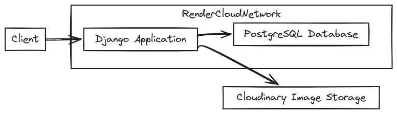

<h1 align="center">
    <picture>
        
    </picture>
</h1>
<p align="center">
    <br>
    <a href="https://github.com/gh0stfrk/djangoblogs/actions">
        
    </a>
    <a href="https://opensource.org/licenses/BSD-3-Clause">
        
    </a>
    <a href="https://twitter.com/gh0stfrk">
        
    </a>
</p>
Django Blogs is a simple and lightweight blogging application built with Django.

It allows users to register and create their own blogs where they can write short and informative posts.

## 🔥 Features
- Sign up and create profiles, customize your profiles with avatars
- Create mini-blog posts, update them and share them
- Likes and Comments, like posts and comment your own thoughts.

## 📦 Structure 
- Django project contains two applications one is `users` and the other one is `blogs`.
- `users` app is controlling all things user related, inculding sign up, registering and updating user information.
- Signals are used to create user profile when a user is created, the user profile contains additional information about a user, such as profile photo.
- `blogs` app is responsible for creating and updating blogs.

## 🏛️ Infrastructure


## 👷 Development Environment 
- Clone the latest branch
```bash
git clone https://github.com/gh0stfrk/django-blog.git
cd djangoblog
```
- Create a virtual environment (use python 3.10)
```
python3 -m venv venv
source ./venv/source/activate
```
- Install dependencies 
```bash
pip install -r requirements-deploy.txt
```
- Setup postgres database credentials in a .env file, copy the contents of [.sample.env](./sample.env)

