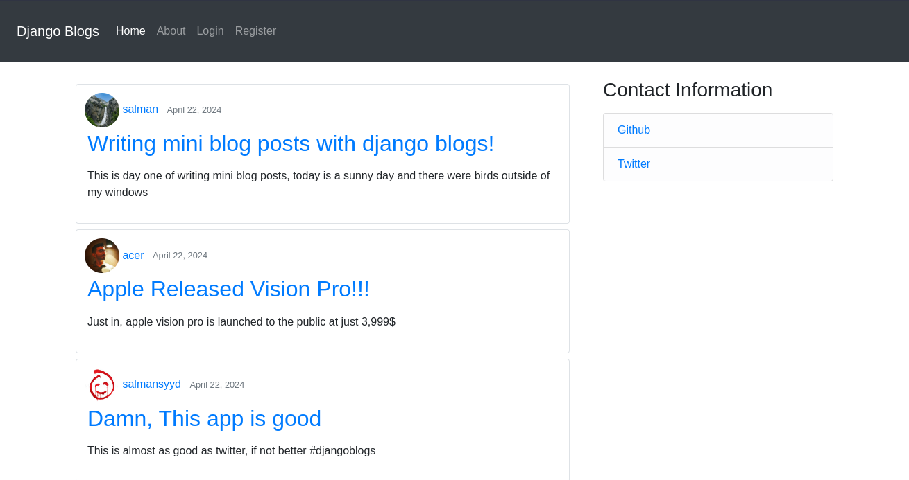
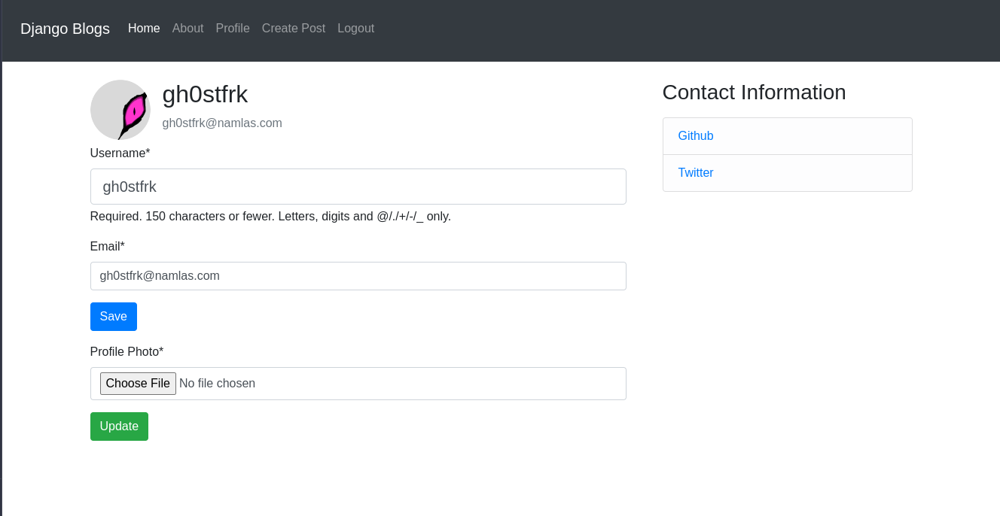

# Django Blogs 
Django Blogs is a simple and lightweight blogging application built with Django.

It allows users to register and create their own blogs where they can write short and informative posts.

## App Structure 
- Django project contains two applications one is `users` and the other one is `blogs`.
- `users` app is controlling all things user related, inculding sign up, registering and updating user information.
- Signals are used to create user profile when a user is created, the user profile contains additional information about a user, such as profile photo.
- `blogs` app is responsible for creating and updating blogs.

## Development Environment 
- Clone the latest branch
```bash
git clone https://github.com/gh0stfrk/django-blog.git
cd djangoblog
```
- Create a virtual environment (use python 3.10)
```
python3 -m venv venv
source ./venv/source/activate
```
- Install dependencies 
```bash
pip install -r requirements.txt
```
- Setup postgres database credentials in a .env file
```bash
# Postgres db information
DB_NAME=
DB_USER=
DB_PASSWORD=
DB_HOST=
DB_PORT=
```

## Screenshots


